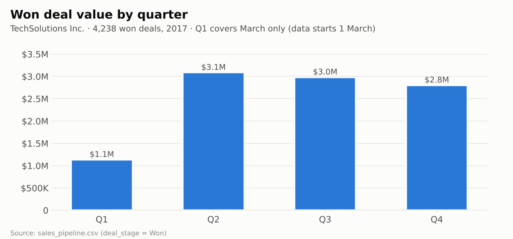
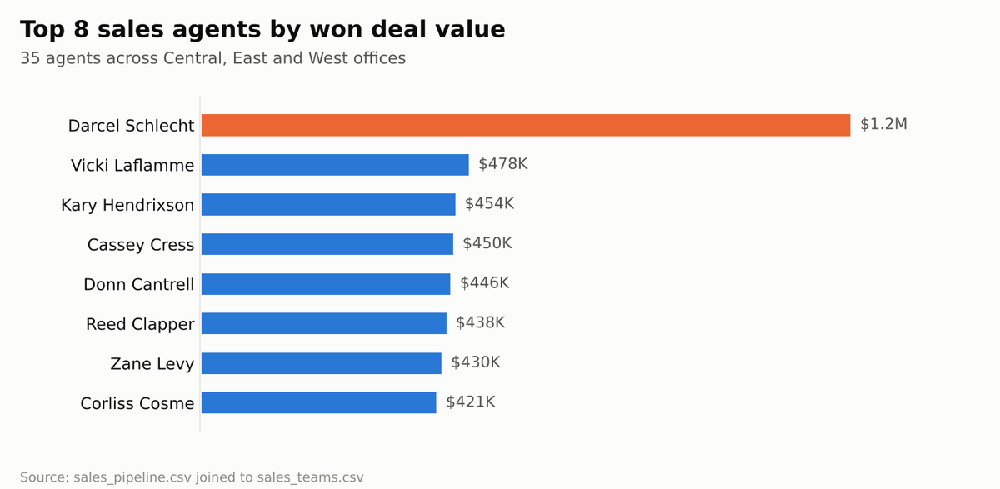

# 💼 B2B Sales Pipeline CRM Dashboard — TechSolutions Inc.

**Sales & CRM Analytics | Excel • PivotTables • Pipeline Performance • Interactive Reporting**

An Excel dashboard that tracks the B2B sales pipeline of a fictional computer hardware company, **TechSolutions Inc.**, showing quarterly sales performance by deal stage, sales agent, manager and region.


## Business value

Consolidate CRM opportunities into quarterly views for sales managers. PivotTables, charts and slicers make deal stages, agent performance and regional differences easier to explore.

### Questions this project addresses

- How does the mix of won, lost and open opportunities vary by quarter?
- Which agents and regions contribute the most won deal value?
- How does performance change when filtering by manager?


## 📋 Overview

Sales managers need to see at a glance how their teams are doing each quarter. This project takes raw CRM data — 8,800 sales opportunities handled by 35 sales agents — and turns it into an interactive dashboard for tracking quarter-by-quarter performance.

## 📈 Results at a Glance

Charts built with Python (pandas + matplotlib) from the data files in this repo.

<p align="center"></p>

<p align="center"></p>

## 🗂️ Dataset

| File | Rows | Description |
|------|------|-------------|
| `sales_pipeline.csv` | 8,800 | Every opportunity: agent, product, account, deal stage, engage/close dates, close value |
| `sales_teams.csv` | 35 | Sales agents, their managers and regional office |
| `accounts.csv` | 85 | Customer companies: sector, year established, revenue, employees, location |
| `products.csv` | 7 | Product catalogue with series and list price |
| `data_dictionary.csv` | 21 | Field definitions for every table |

**Deal stages:** Prospecting → Engaging → Won / Lost
**Period:** deals closed March – December 2017

## 📊 Dashboard

`CRM SALES DASHBOARD.xlsx` contains:

- **sales_pipeline** and **sales_teams** — the source data, with each agent's manager and regional office joined onto the pipeline
- **Quarterly Sales Performance** — the dashboard:
  - PivotTables counting opportunities per quarter, broken down by **deal stage** and by **sales agent**
  - A **pie chart** and a **bar chart** summarising the pipeline
  - **Slicers** for **manager** and **regional office** to filter the whole view

## 💡 Key Figures (from the data)

- **4,238 deals won**, worth about **$10.0M** in total
- **Win rate of 63%** on closed deals (won vs. lost)
- **West** was the top region (~$3.6M), ahead of Central (~$3.3M) and East (~$3.1M)
- **GTX Pro** was the top revenue product (~$3.5M)
- **Darcel Schlecht** was the top-performing agent (~$1.15M closed)

> Data-quality note: the product `GTX Pro` appears as `GTXPro` in the pipeline table but `GTX Pro` in the product table, so the two need standardising before joining.

## 📁 Repository Contents

```
├── CRM SALES DASHBOARD.xlsx   # Excel dashboard
├── sales_pipeline.csv
├── sales_teams.csv
├── accounts.csv
├── products.csv
├── data_dictionary.csv
└── README.md
```

## 🚀 How to Use

Download `CRM SALES DASHBOARD.xlsx`, open it in Microsoft Excel, and use the slicers on the **Quarterly Sales Performance** sheet to filter by manager or regional office.

## 🛠️ Skills Demonstrated

Data preparation · PivotTables & PivotCharts · date grouping by quarter · slicers & interactive filtering · dashboard layout · sales pipeline analysis

---

👤 **Tony Mulunda** — [GitHub @Scarface96](https://github.com/Scarface96)

## Interpretation & limitations

TechSolutions Inc. is fictional. Closed-deal win rate excludes open opportunities. Won deal value is a historical sales measure; the workbook should not be presented as a validated revenue forecast.

## Explore the analytics portfolio

- [sql_retail_sales_p1](https://github.com/Scarface96/sql_retail_sales_p1)
- [HR-Analysis-Dashboard](https://github.com/Scarface96/HR-Analysis-Dashboard)
- [Global-CO2-Emissions-Dashboard](https://github.com/Scarface96/Global-CO2-Emissions-Dashboard)
- [Toy-Store-KPI-Report](https://github.com/Scarface96/Toy-Store-KPI-Report)

## About This Project

A business intelligence project designed to help sales leaders understand pipeline health, team performance and regional results. It demonstrates Excel-based CRM analytics, PivotTables, interactive filtering and the ability to translate sales data into management-ready insights.
